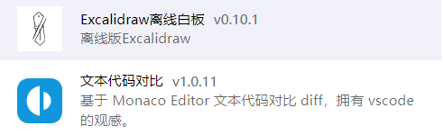
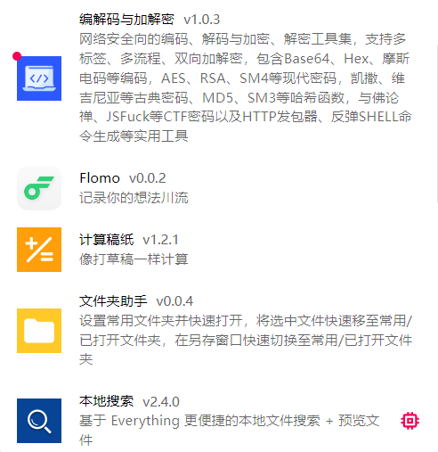
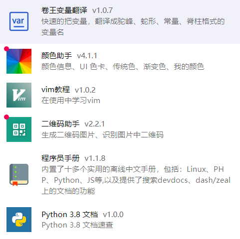
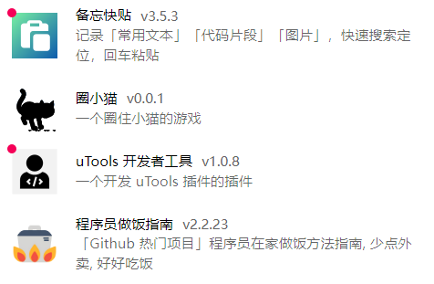
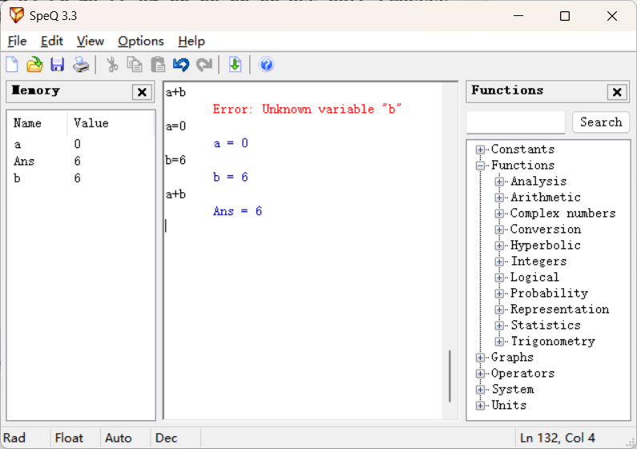
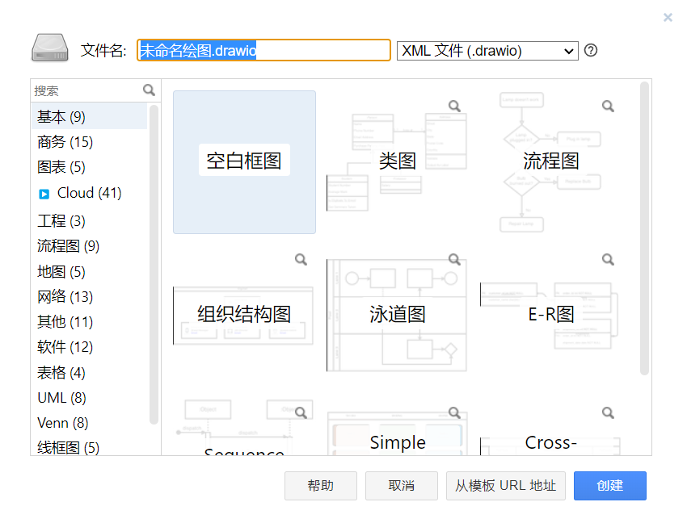

# 2023电控组线上学习内容

> 

## 软件推荐

> 工欲善其事，必先利其器。
>
> 优秀的电脑软件配置提高学习工作效率。
>
> 以下是我推荐的一些电脑软件配置，仅供参考。
>
> 部分软件分享在git中。

### UTOOLS

#### 功能

- 快速打开应用
- 快速寻找文件
- 画流程草图
- 快速变量命名
- 查看一些基本函数语法
- 功能通过软件中的插件进行安装

#### 插件推荐

> 注：以下插件为我个人使用习惯，可以根据功能选择性安装。

### XMind

#### 功能

- 画流程图
- 展现思维过程
- 理顺逻辑
- 在短时间内弄明白自己要做什么事
- 随手记录问题

> 注：免费版够用了

### Typora

#### 功能

- 写一些文档（比如此文档）
- 需要简单了解.md语法
- 做记录和学习积累

> 注：名义上软件不是免费的

### Sourcetree

#### 功能

- 图形化git管理工具
- 比起命令行友好很多

### MiniHex

#### 功能

- 分析bin文件
- 大多数情况没用

### SpeQ Mathematics

#### 功能

- 简单数学运算

### Beyond Compare

#### 功能

- 非常强大的文本代码对比工具

- 几个人合着写一份代码时可以使用此工具对比合并

### 7-Zip

#### 功能

- 解压软件、个人使用习惯

### draw.io

#### 功能

- 画各种图

### Everything

#### 功能

- 快速搜索文件
- 管理文件
- 配合Utools使用

### UartAssist串口调试助手

#### 功能

- 调试串口

### vofa+

#### 功能

- 调试串口
- 绘制图像
- 还可以进行傅里叶分析

### Matlab

#### 功能

- 进行数学分析

### Shapr3D

#### 功能

- 3D绘图软件
- 适合IPAD
- 非常简单，迅速表达结构想法
- 直接输出3D打印格式
- 学生免费体验一年

### Notepad++

#### 功能

- 文本编辑软件
- 打开速度快
- 适合迅速更改配置

### vscode

#### 功能

- 可以下载keil插件平时写代码用
- 快捷打开文档
- 自适应编码格式
- 好看

### SOLIDWORKS

#### 功能

- 检查图纸
- 根据3D结构图直接进行控制编程
- 和机械版本统一（不然打不开图纸）

### Source Code Pro 字体

#### 功能

- 等宽字体
- 适合作为代码字体

