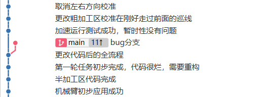

# 2023电控组线上学习内容

> written by 行黎

## 软件推荐

> 工欲善其事，必先利其器。
>
> 优秀的电脑软件配置提高学习工作效率。
>
> 以下是我推荐的一些电脑软件配置，仅供参考。
>
> 部分软件分享在git中。

### UTOOLS

#### 功能

- 快速打开应用
- 快速寻找文件
- 画流程草图
- 快速变量命名
- 查看一些基本函数语法
- 功能通过软件中的插件进行安装

#### 插件推荐

> 注：以下插件为我个人使用习惯，可以根据功能选择性安装。

### XMind

#### 功能

- 画流程图
- 展现思维过程
- 理顺逻辑
- 在短时间内弄明白自己要做什么事
- 随手记录问题

> 注：免费版够用了

### Typora

#### 功能

- 写一些文档（比如此文档）
- 需要简单了解.md语法
- 做记录和学习积累

> 注：名义上软件不是免费的

### Sourcetree

#### 功能

- 图形化git管理工具
- 比起命令行友好很多

### MiniHex

#### 功能

- 分析bin文件
- 大多数情况没用

### SpeQ Mathematics

#### 功能

- 简单数学运算

### Beyond Compare

#### 功能

- 非常强大的文本代码对比工具

- 几个人合着写一份代码时可以使用此工具对比合并

### 7-Zip

#### 功能

- 解压软件、个人使用习惯

### draw.io

#### 功能

- 画各种图

### Everything

#### 功能

- 快速搜索文件
- 管理文件
- 配合Utools使用

### UartAssist串口调试助手

#### 功能

- 调试串口

### vofa+

#### 功能

- 调试串口
- 绘制图像
- 还可以进行傅里叶分析

### Matlab

#### 功能

- 进行数学分析

### Shapr3D

#### 功能

- 3D绘图软件
- 适合IPAD
- 非常简单，迅速表达结构想法
- 直接输出3D打印格式
- 学生免费体验一年

### Notepad++

#### 功能

- 文本编辑软件
- 打开速度快
- 适合迅速更改配置

### vscode

#### 功能

- 可以下载keil插件平时写代码用
- 快捷打开文档
- 自适应编码格式
- 好看

### SOLIDWORKS

#### 功能

- 检查图纸
- 根据3D结构图直接进行控制编程
- 和机械版本统一（不然打不开图纸）

### Source Code Pro 字体

#### 功能

- 等宽字体
- 适合作为代码字体

## 学习内容

> - 要使用git管理学习路径以及学习成果
>
> - 未特别标注的均为线上预学习内容
> - 有问题及时群里发问讨论

### git/github/gitee的使用

#### 作用

- 进行版本管理
- 能够记录学习路径与代码更改
- 多人共同开发合并代码

#### 要求

- 能够进行代码版本管理
- 能够与远程库进行通信
- 掌握修改暂存与提交
- 尝试多人开发中的代码合并以及解决冲突
- 在之后的代码编写过程中通过git展示学习路径

#### 教程

[廖雪峰git教程](https://www.liaoxuefeng.com/wiki/896043488029600)

年代较为久远，有些教程内容与现在的github版本不兼容，若存在问题可以自行查找其他教程学习。

### STM32CubeMX & Keil的使用

#### STM32CubeMX

##### 作用

- 对stm32芯片进行配置，方便快捷的生成初始化代码帮助程序编写。
- 增加一些常用库，如freertos，快捷配置操作系统。

#### Keil

##### 作用

- 代码编辑器&编译器
- keil的调试功能非常强大，便于对代码进行debug分析

#### 要求

- 熟练掌握拿到开发板从cubemx开始的配置步骤，并生成代码
- c语言至少要过关，能够独立完成发布的简单代码任务
- 要学会使用debug调试，查看变量，断点调试等

#### 教程

[小蜜蜂教程](https://www.bilibili.com/video/BV1m7411H7oT?p=1&vd_source=32325785fc21ec9436e032bedbdc51fb)

手把手教学了cubemx配置以及keil的使用

同时介绍了一些外设的配置

### 具体学习内容

#### 外设等技术部分

##### GPIO

- 直接控制led灯的亮灭
- 使用PWM实现呼吸灯效果
- 通过GPIO捕获按键输入
  - 直接读取电平状态
  - 通过中断的方式捕获

##### TIM

- 使用定时器进行中断触发
- 使用定时器输出PWM进行舵机控制

##### UART

- 学会使用usb转ttl模块与电脑进行串口通信
- 单片机的数据发送要使用阻塞式发送和非阻塞式（dma）的方式进行
- 单片机的数据接收要使用普通中断的方式和dma的方式进行
- 了解数据的大端模式和小端模式，能对电脑发送的数据进行正确解析（不是以字符串的方式）
- 通过串口通信控制LED灯的亮灭等

- 尝试编写一种通信协议格式（定长），如下：

| 帧头     | 命令     | 数据                              | 帧尾     |
| -------- | -------- | --------------------------------- | -------- |
| 一个字节 | 一个字节 | 一个int类型的数据，32位，四个字节 | 一个字节 |

注：可以了解一下奇偶校验以及crc校验

##### IIC

- 了解IIC这种半双工简单总线通信协议
- 通过IIC驱动OLED显示屏

##### SPI（与IIC可任选其一尝试）

- 了解SPI协议
- 通过SPI协议驱动OLED显示屏

##### CAN

- CAN通信非常重要，基地内电机电调大多使用此协议

- 了解CAN通信协议
- 了解使用CAN通信中断接收数据的方法
- 如果有条件进行两台设备的CAN组网测试

注：CAN的优点在于其为总线协议，可以多台设备组网运行

##### ADC

- 学习使用ADC采样

##### FreeRTOS

- 一种嵌入式实时操作系统
- 要学会使用创建多个任务运行，如在三个进程中分别完成流水灯，屏幕驱动，uart发送信息
- 要掌握信号量的概念

##### 一些模块的使用

- 超声波
- 灰度管
- 封装好的陀螺仪
- ...
- 不做要求

#### 算法部分

##### PID控制算法

- 用于控制电机速度，位置等
- 能够自行编写pid控制算法，理解比例、积分、微分量的作用
- 线上学习时无设备控制，要保证线下时电机通信没问题时能够快速运用pid算法
- 可以更加深入学习一点进阶的控制，如积分分离等

##### 滤波算法

- 卡尔曼滤波
- 中值滤波
- 平均滤波
- ...
- 不做具体要求，建议有个数据滤波的思想就可以了

##### 控制理论

[DR_CAN](https://www.bilibili.com/video/BV1yx411u7iX/?spm_id_from=333.999.0.0&vd_source=32325785fc21ec9436e032bedbdc51fb)

让人眼界大开

#### 其他

##### 编程修养

可以参考，只要代码写的不是很离谱都可以接受

##### markdown 文件编写

方便记录学习

##### 软件STM32 ST-LINK Utility

一般用于擦除芯片flash

#### 线下培训内容

- 逻辑分析仪的使用
- 电机控制（c610、c620、elmo、vesc电调）
- nrf手柄的使用
- 一些传感器的使用（陀螺仪，激光传感器，光电门等）
- DAP/ST-Link烧录器的使用
- 一些前人的库的使用

## 硬件购买

> 线下培训时会提供开发板及其他外设用于学习
>
> 本章节推荐一些硬件设备帮助自学

### 烧录器

推荐 ST-LINK

### 开发板

要有CAN，SPI，IIC，UART等

[可以单买板子，也可以连着烧录器一起买，电路组推荐的](https://item.taobao.com/item.htm?id=630545119702&price=58-76&sourceType=item&sourceType=item&suid=7a19d0ea-2294-4153-ae36-b51edcf69dcb&shareUniqueId=22067925795&ut_sk=1.Xwmjy67I66oDANtEMfQp0gOu_21646297_1687520074316.TaoPassword-QQ.1&un=713e306de3bc4a468c909781ef4cb5b1&share_crt_v=1&un_site=0&spm=a2159r.13376460.0.0&sp_abtk=gray_1_code_simpleAndroid2&tbSocialPopKey=shareItem&sp_tk=ZGdTWWRJNmNUdG0%3D&cpp=1&shareurl=true&short_name=h.5aLIJxk&bxsign=scdHlIdEd55Ooc0W-eHUXPjW6pAzb6qoM-uG0LOwxeNvwbCVGGZVR2Bz1FwEMrECpHuYzYYtoXJroucHpSOApPGbL9hDQM5pVNji66N2VDxeLhsIiqI5Ksr9_m88qBLo64dQRftz48YSUha41rRtceiJQ&tk=dgSYdI6cTtm&app=chrome)

### USB转TTL

用于与电脑进行串口通信

### 屏幕

注意是想要使用IIC还是SPI协议驱动，买对应的

用来练习就买便宜的0.96寸就可以了

### 杜邦线

注意公对公，公对母，母对母的区别

